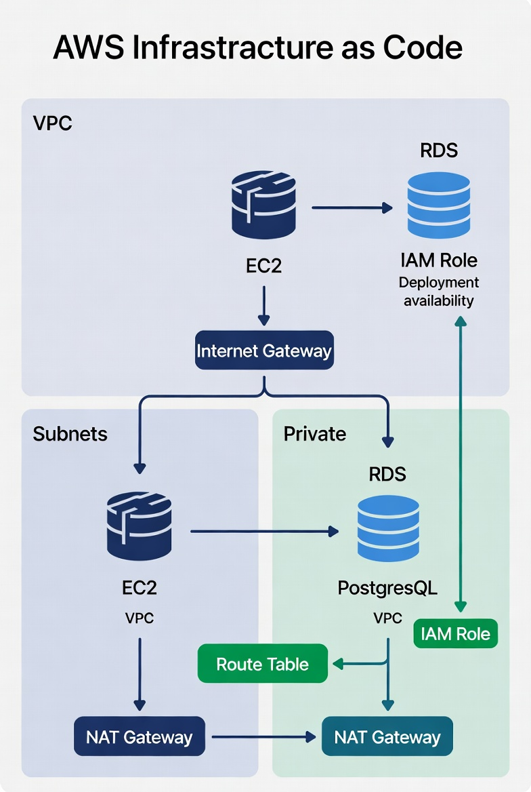
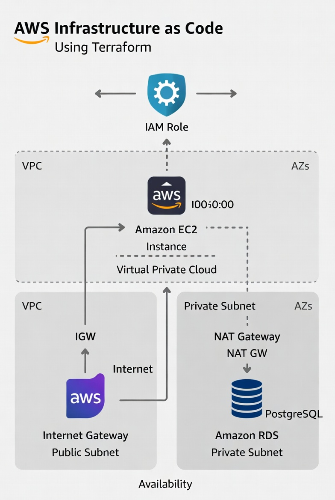

# AWS Infrastructure as Code com Terraform

<p align="center">
  
  
  
  
  
</p>

**Projeto de portfólio que demonstra IaC completa na AWS com Terraform:**  
VPC customizada + EC2 + RDS PostgreSQL + IAM Role + separação de ambientes (dev/staging/prod) + modularização profissional + foco em segurança e escalabilidade.

> "Queria mostrar que consigo projetar e provisionar infraestrutura production-ready de forma limpa, segura e reproduzível — sem clicar no console."

### O que este projeto entrega (em 30 segundos)

- VPC com subnets públicas e privadas
- EC2 em subnet pública (com IAM Role — sem chaves fixas)
- RDS PostgreSQL em subnet privada (sem exposição à internet)
- Multi-AZ em produção para alta disponibilidade
- Arquitetura modular (modules reutilizáveis)
- Ambientes isolados (dev / staging / prod)
- Tudo provisionado via código Terraform

### Arquitetura completa

<p align="center">
  
</p>

<p align="center">
  
</p>

**Fluxo principal:**
- Internet → Internet Gateway → Subnet Pública → EC2 (app layer)
- EC2 → VPC interna → Subnet Privada → RDS PostgreSQL
- RDS isolado (sem acesso público)
- IAM Role garante acesso seguro sem credenciais hardcoded

- [Diagrama clean VPC + EC2 + RDS (recomendado – production-ready)](https://miro.medium.com/v2/resize:fit:1400/1*2Hv4lH0-1fhM3ZQ2tWcQ_g.png)  
- [Terraform modules com dev/staging/prod + VPC/EC2/RDS](https://i.ytimg.com/vi/0uxcZEFjizo/sddefault.jpg)  
- [VPC multi-AZ com subnets, NAT, EC2 e RDS](https://miro.medium.com/1*Ng3kWlSQqIk5rECJb26YPA.png)

### Tecnologias & Ferramentas

| Categoria       | Ferramenta       | Por que usei?                                      |
|-----------------|------------------|----------------------------------------------------|
| IaC             | Terraform        | Provisionamento declarativo e idempotente          |
| Cloud           | AWS              | VPC, EC2, RDS, IAM                                 |
| Rede            | VPC              | Isolamento, subnets públicas/privadas              |
| Compute         | EC2              | Camada de aplicação (com IAM Role)                 |
| Database        | RDS PostgreSQL   | Banco gerenciado, seguro e escalável               |
| Segurança       | IAM, Security Groups | Least privilege, sem exposição desnecessária     |

### Estrutura do Projeto (modular e escalável)

```
terraform-aws-iac/
│
├── modules/
│   ├── network/       # VPC, subnets, IGW, NAT, route tables
│   ├── iam/           # Roles e policies
│   ├── compute/       # EC2 + security groups
│   └── database/      # RDS PostgreSQL
│
├── environments/
│   ├── dev/           # tfvars simplificados
│   ├── staging/       # Mais recursos, mas sem full HA
│   └── prod/          # Multi-AZ, backups, etc.
│
├── main.tf            # Entry point por ambiente
├── variables.tf
├── outputs.tf
└── README.md
```

### ⚙️ Ambientes configurados

| Ambiente  | Objetivo              | Características principais                  |
|-----------|-----------------------|---------------------------------------------|
| dev       | Desenvolvimento       | Single-AZ, custo baixo, rápido              |
| staging   | Testes/QA             | Multi-AZ parcial, similar à prod            |
| prod      | Produção              | Multi-AZ full, alta disponibilidade, backups |

### 🔐 Decisões de segurança e melhores práticas

- RDS 100% privado (sem public access)
- EC2 sem chaves SSH hardcoded → usa IAM Role
- Security Groups restritivos (least privilege)
- Subnets privadas com NAT Gateway (outbound controlado)
- Modularização → fácil manutenção e reutilização
- Variáveis por ambiente → evita repetição

### 🚀 Como executar (passo a passo)

**Pré-requisitos**
- Terraform ≥ 1.5 instalado
- AWS CLI configurada (`aws configure`)
- Conta AWS com permissões adequadas

1. Clone o repositório
   ```bash
   git clone https://github.com/SEU_USUARIO/terraform-aws-iac.git
   cd terraform-aws-iac
   ```

2. Escolha o ambiente
   ```bash
   cd environments/dev   # ou staging / prod
   ```

3. Inicialize
   ```bash
   terraform init
   ```

4. Planeje (veja o que vai criar)
   ```bash
   terraform plan
   ```

5. Aplique
   ```bash
   terraform apply --auto-approve   # (cuidado em prod!)
   ```

6. (Opcional) Verifique outputs
   ```bash
   terraform output
   ```

**Destruir (importante para evitar custos!)**
```bash
terraform destroy
```

### Habilidades demonstradas

- IaC com Terraform (módulos + multi-ambiente)
- Design de rede segura na AWS (VPC best practices)
- Configuração de EC2 + RDS com segurança
- Uso de IAM Roles (zero hardcoded credentials)
- Pensamento production-ready (Multi-AZ, escalabilidade futura)
- Documentação clara e reproduzível
